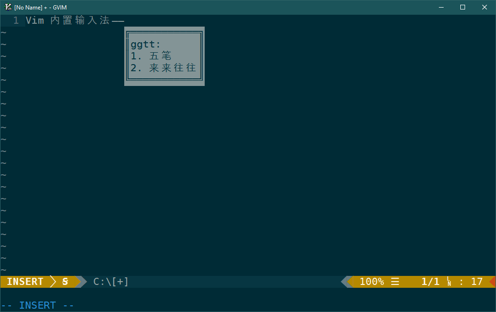

# Vim 的内置五笔输入法
## 背景
灵感可能源于 Vimim。内置输入法的好处就是和 Vim 的操作逻辑无缝衔接，比如输入法
能够理解插入模式普通模式的区别，能理解命令行模式(:)和搜索输入(/)，而 Vim 其实
已提供了相关的配置选项。

另一方面原因是 Vim-8 以后增加了好多有趣的新功能，比如异步IO、popup-window。
想写点Vim 脚本熟悉一下。

五笔，或其它码表类的输入法，输入逻辑比较简单，加上一常用功能之后就可以用得很
舒服。目前这个项目的代码仅有 300 行左右，但个人感觉和某些系统自带的输入法
相比已经是好用不少了。欢迎大家试用〜

另外能自己配置还是比较方便，比如用 Vim 写 LaTeX，或者我现在正常写的
markdown，就可以显著减少中英切换的次数。

Vimim 和其它类似的输入法(好像)用的都是 compeletfunc 机制，这样只能用`<C-n>`或
`<C-p>`选词，这与一般的输入法习惯不是很一致。本输入法的实现是用 InsertCharPre 自动
命令触发，触发后接管用户输入，再用 popup-window 来显示/选择候选词。大概在 Vimim 的
年代还没有这个 Event。

感谢 Vim 的不断进化！

## 依赖与安装
### 依赖
需要 Vim-8.2 及以上，需要的功能如下:
|功能|引入版本|
|----|-------|
|feedkeys()|7.0|
|InsertCharPre|7.4|
|Vim packages|8.0|
|Lambda expression|8.0|
|Popup-windows|8.2|
|Method call|8.2|

### 安装与卸载
下载之后解压到
* Windows: `$HOME/vimfiles/pack`
* Unix-like: `$HOME/.vim/pack`

当然也可 `git clone` 到上述位置。

在vimrc 中加上
```packadd! imtalbe```

如果想禁用插件，只需去掉 vimrc 中 `packadd` 那一行；卸载的话再删掉解压出来的
`imtable` 文件夹就行了。

### 使用
在插入模式下用 <C-^> 来切换中英文状态（目前在什么状态没提示，只能打一下字试试）。
其它就是正常使用 Vim 了。

详情可以参考 Vim 手册：
`:h i_CTRL-^`

也许有人喜欢设置 `&imsearch` 和 `&imcmdline`，希望能在搜索和命令行编辑时也使用
输入法。但我现在的实现不行，这两种模式虽然很像插入模式，但不会触发 InsertCharPre。
折衷的方法是在想输入中文的时候用 `<C-f>` 打开命令行窗口(command-line window)，这
里面可以正常用插入模式，输好之后回车就能正常执行命令并自动关闭命令行窗口了，也不
算麻烦。

## 已经实现的功能
1. 支持分号(`;`)、撇号(`'`)次选三选, 按键可配置
1. 支持中英文标点切换(`<C-b>`), 按键可配置
1. 输入数字后, 无论中英标点状态, 句号自动半角
1. 回车可用于编码上屏, 或首选词上屏并输入回车, 可配置
1. 支持z重复最后一次的输入
1. 空码时, 根据 `&visualbell` 的值, 鸣响或闪屏提示
1. 临时英文输入(`;`)，按键可配置
1. ……

## 可能会增加的功能
1. 整合到 airline 中，提示输入状态
1. 自造词
1. 写文档。现在能配置的选项要去 `config.vim` 里自己看。
1. 随手写的，之后可能会增加一些测试，提高点质量
1. ……

## 可能不会有的功能
1. 自动调整词频
1. 将 z 用于通配符
1. ……

## 截图

